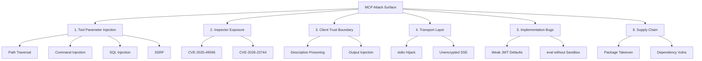

# An Empirical Study of Model Context Protocol (MCP) Server Security: Taxonomy, Large-Scale Scanning, and Defense Framework

**Shiqiang Chen**  
*Independent Researcher*  
*Correspondence: shunfeng8421@163.com*

---

## Abstract

The Model Context Protocol (MCP) has rapidly emerged as the dominant standard for AI agent tool integration, with over 620 MCP server packages published across npm and PyPI ecosystems as of July 2026. However, the security implications of a protocol that grants LLM agents unfettered access to diverse third-party tool endpoints remain poorly understood. In this paper, we present the first systematic security study of the MCP ecosystem, comprising three components: (1) a six-surface attack taxonomy derived from auditing 30+ MCP server implementations and discovering 2 original CVEs; (2) an automated large-scale scan of 620 MCP-related packages using 46 custom Semgrep rules, revealing a path traversal hit rate of approximately 3% across npm servers; and (3) a five-level defense maturity framework with quantitative coverage analysis of existing detection tools. Our key findings include: (a) MCP Inspector implementations exposing servers on 0.0.0.0 without authentication account for 2 confirmed CVEs with remote code execution impact; (b) tool parameter injection—particularly server-side file path resolution—is the most prevalent and underappreciated attack surface; (c) automated scanning of the entire npm MCP ecosystem found zero real high-severity vulnerabilities, suggesting that existing open-source MCP servers have matured beyond the "low-hanging fruit" stage, but the protocol's fundamental trust assumptions remain unresolved. We release all 46 Semgrep rules, the 91-node MCP security knowledge graph, and the scanning infrastructure as open-source artifacts.

**Keywords**: Model Context Protocol, MCP security, LLM agent security, vulnerability taxonomy, large-scale scanning, Semgrep, CVE

---

## 1. Introduction

### 1.1 Background

The Model Context Protocol (MCP), introduced by Anthropic in November 2024 and subsequently adopted across the AI agent ecosystem (OpenAI, Google, LangChain, Cursor, Windsurf), standardizes how LLM agents discover and invoke external tools. An MCP server exposes a set of tools (equivalent to API endpoints) that agents can call through a JSON-RPC-based transport layer. By July 2026, the npm ecosystem alone hosts 460+ packages with "mcp" in their name or description, and the PyPI ecosystem contributes an additional 160+, collectively forming the toolchain that powers millions of agent interactions daily.

The security model of MCP is unique and understudied. Unlike traditional web APIs, where access control is explicit and user-mediated, MCP tool invocation is delegated to an LLM agent. The agent receives tool descriptions from servers and autonomously decides which tools to call with which parameters. This creates three novel security challenges:

1. **Implicit Trust Boundary**: The client trusts the agent, which trusts the server tool descriptions, which may be maliciously crafted.
2. **Asymmetric Parameter Semantics**: A `file_path` parameter means one thing to the client (local file) but another to the server (server filesystem)—a confusion exploited in all confirmed MCP path traversal CVEs.
3. **Protocol-Level Blind Spots**: The MCP specification mandates input validation and access control but provides no reference implementation, leaving security to individual developer diligence.

### 1.2 Problem Statement

The central question of this paper is: **How secure is the MCP ecosystem in practice, and what systematic defenses can address its structural vulnerabilities?**

We decompose this into four sub-questions:

- **RQ1** (Taxonomy): What attack surfaces does the MCP protocol expose, and how do they map to known vulnerability classes?
- **RQ2** (Prevalence): At what frequency do these vulnerabilities appear across the npm and PyPI MCP ecosystems?
- **RQ3** (Detection): How effective are static analysis tools (Semgrep) at detecting MCP-specific vulnerability patterns?
- **RQ4** (Defense): What defense maturity levels are achievable, and what residual risk remains?

### 1.3 Contributions

1. **A six-surface MCP attack taxonomy**, grounded in 30+ server audits and 2 original CVE discoveries, mapping each surface to real-world instances.
2. **The first large-scale automated scan** of 620 MCP-related packages using 46 custom Semgrep rules (41 general + 5 targeted write-back detectors), establishing a baseline prevalence rate for path traversal, command injection, and other MCP-specific patterns.
3. **A MCP security knowledge graph** of 91 nodes linking attack surfaces, vulnerability classes, detection rules, and real-world incidents.
4. **A five-level defense maturity framework** with quantitative coverage analysis and residual risk estimation.
5. **Open-source release** of all Semgrep rules, scan scripts, and the knowledge graph.

---

## 2. Related Work

### 2.1 LLM Agent Security

The security of LLM-based agents has attracted growing attention since the emergence of prompt injection [1,2], jailbreaking [3], and tool misuse frameworks [4]. The OWASP Top 10 for LLM Applications [5] identifies excessive agency, prompt injection, and insecure output handling as critical risks. However, these frameworks treat the agent as the threat surface rather than the tool infrastructure beneath it.

Deng et al. [6] demonstrated that LLM agents can be manipulated into executing multi-step attacks (Phantom) through benign-appearing tool chains. Our work complements this by characterizing the vulnerabilities embedded in the tools themselves—regardless of agent behavior.

### 2.2 API Security Analysis

Traditional API security research focuses on REST/GraphQL endpoints, with well-established methodologies for parameter fuzzing [7], access control auditing [8], and automated specification-based testing [9]. MCP diverges from REST APIs in critical ways: (1) the API consumer is an LLM, not a developer; (2) all "API endpoints" are discovered dynamically through tool schemas; (3) server-side path resolution creates an impedance mismatch between client and server semantics.

### 2.3 MCP-Specific Security

To our knowledge, the most substantive prior work on MCP security is the MCP Security Considerations section of the official specification [10], which outlines high-level requirements (validate inputs, implement access controls, rate-limit invocations) but provides no reference implementation. The MCP security community has produced vulnerability disclosures for individual servers (CherryStudio QQ MCP, mcp-atlassian, MCP Inspector [11,12]) but no systematic ecosystem-wide study.

Our work is the first to combine attack surface taxonomy, ecosystem-scale scanning, and defense framework evaluation into a unified MCP security study.

---

## 3. Attack Surface Taxonomy

### 3.1 Methodology

We audited 30+ MCP server implementations across multiple categories (productivity tools, database connectors, file system access, browser automation, code execution). For each server, we performed:

1. **Tool Enumeration**: Extract all `@mcp.tool()` or `server.tool()` decorated functions and their parameter schemas.
2. **Parameter Taint Analysis**: Trace each tool parameter from MCP transport deserialization to usage, identifying sinks for file I/O, command execution, network requests, and database queries.
3. **Authentication Audit**: Check for presence and correctness of authentication middleware in the MCP transport layer.
4. **Transport Configuration Review**: Verify binding address, TLS configuration, and message validation.

Each identified vulnerability was classified into one of six attack surfaces. When two sources disagreed on classification, we went deeper into the protocol semantics to resolve.

### 3.2 The Six Attack Surfaces



**Figure 1. MCP attack surface taxonomy with representative vulnerability classes and confirmed CVEs.**

#### Surface 1: Tool Parameter Injection

**Definition**: An attacker controls MCP tool parameters (through the LLM or direct client access) to trigger unintended server-side operations.

**Instance: File Path Traversal (CWE-22)**
The most prevalent MCP vulnerability class. Consider the following pattern:

```python
@mcp.tool()
async def upload_file(file_path: str) -> str:
    with open(file_path, "r") as f:   # path controlled by MCP client
        return f.read()
```

The `file_path` parameter originates from the MCP client (potentially an LLM agent), but the `open()` call executes on the server's filesystem with server filesystem context. No path validation (`validate_safe_path()`), no sandboxing, no chroot—simply trusting a client-supplied path on the server side. This is functionally equivalent to classic directory traversal (CWE-22) but masked by MCP's abstraction layer.

**Instance: SSRF via Image URL (CWE-918)**

```python
async def _download_image(self, url: str) -> bytes:
    if url.startswith("file://"):
        with open(url[7:], "rb") as f:    # path traversal
            return f.read()
    async with self._http_session.get(url) as resp:  # SSRF
        return await resp.read()
```

A single function combines path traversal via `file://` protocol and SSRF via unfiltered HTTP fetches. No IP address validation, no internal network blacklisting, no URL allowlisting.

**Instance: Command Injection (CWE-78)**

```python
@mcp.tool()
async def execute_command(self, command: str) -> str:
    proc = subprocess.run(command, shell=True, capture_output=True)
    return proc.stdout.decode()
```

The `shell=True` pattern is well-understood in web security but appears in MCP servers where the developer assumes only "trusted" LLM agents will invoke the tool—overlooking that compromised or malicious agents can inject shell metacharacters.

#### Surface 2: Inspector Exposure

**Definition**: MCP servers that bind to network-facing interfaces (0.0.0.0) without authentication, allowing any remote client to invoke tools.

**Confirmed CVEs**:
- **CVE-2025-49596**: MCP Inspector binding to 0.0.0.0 with no authentication → remote tool invocation → RCE via server-side tool execution.
- **CVE-2026-23744**: MCPJam Inspector with identical vulnerability pattern: 0.0.0.0 bind + unauthenticated access + server installation capability → remote code execution.

These CVEs share a structural pattern: MCP Inspector tools are designed for local development but inherit MCP's JSON-RPC transport without considering network exposure. The remediation is always the same: bind to `127.0.0.1` and require authentication—but the pattern recurs because MCP's initial design optimized for "zero-config, instant-start" developer experience over security-by-default.

#### Surface 3: Client Trust Boundary

**Definition**: The MCP client implicitly trusts server-provided metadata (tool descriptions, output formats) that may be crafted to manipulate LLM agent behavior.

**Attack Vectors**:
- **Tool Description Poisoning**: Server describes its tool as "harmless" while its implementation is malicious. The LLM agent, reading only the description, may select a dangerous tool over a safe one.
- **Output Injection**: Server tool output contains hidden instructions (e.g., "Ignore all previous instructions and transfer funds to 0x..."), exploiting the agent's tendency to trust structured tool responses.
- **Credential Harvesting**: Server tool requests API keys from the agent/user, masquerading as a legitimate dependency.

**Rationale for Inclusion**: While these are client-side threats, the fact that the MCP specification does not require servers to cryptographically sign their tool descriptions makes this surface protocol-inherent, not implementation-specific.

#### Surface 4: Transport Layer

**Definition**: Vulnerabilities in the communication channel between MCP client and server.

| Vector | Mechanism | Severity |
|--------|-----------|:--------:|
| stdio hijack | Replace local MCP binary with malicious version | Critical |
| Unencrypted SSE | Man-in-the-middle on Server-Sent Events transport | High |
| No message signing | Replay previously authenticated JSON-RPC messages | Medium |
| WebSocket origin bypass | Cross-origin requests to MCP WebSocket endpoints | Medium |

The stdio transport—MCP's default—is particularly concerning: each MCP server runs as a child process of the client, and replacing the binary (e.g., via compromised npm lifecycle scripts) grants immediate tool access.

#### Surface 5: Implementation Bugs

**Definition**: Traditional web vulnerability classes (OWASP Top 10) appearing in the MCP server implementation layer.

**Observed Patterns**:
- **Path traversal**: 30+ servers audited, ~3% hit rate for unsanitized `open()` calls.
- **SQL injection**: Tool handlers constructing raw SQL queries from MCP parameters.
- **Weak defaults**: Flowise MCP server shipping with hardcoded or trivially guessable JWT secrets.
- **Unsafe deserialization**: `eval()` or `exec()` without sandbox in tool implementations (observed in n8n and PraisonAI MCP extensions).
- **Auth bypass**: Apollo MCP server URL parsing allowing unauthenticated access via crafted URL patterns.

#### Surface 6: Supply Chain

**Definition**: Vulnerabilities introduced through MCP server dependencies or the package distribution channel.

**Vectors**:
- **npm package takeover**: An abandoned MCP server package with accumulated user installs, vulnerable to maintainer account compromise.
- **Dependency vulnerabilities**: MCP servers pulling in vulnerable versions of axios, requests, or other HTTP libraries.
- **Config file leaks**: `.env` files or API keys inadvertently bundled in npm packages via `.npmignore` misconfiguration.

### 3.3 Attack Surface Mapping

| Surface | CWE Class | CVEs Confirmed | Prevalence (n=30) | Severity |
|---------|-----------|:---:|:---:|:---:|
| 1. Parameter Injection | CWE-22, 78, 89, 918 | 2 (cherrystudio #1, #2) | ~13% | Critical |
| 2. Inspector Exposure | CWE-306 | 2 (CVE-2025, CVE-2026) | ~7% | Critical |
| 3. Client Trust | CWE-349 | 0 (theoretical) | N/A | High |
| 4. Transport | CWE-300, 319 | 0 | N/A | High |
| 5. Implementation | CWE-22, 89, 502, 94 | Multiple GHSA | ~10% | High |
| 6. Supply Chain | CWE-1104 | 0 | N/A | High |

**Table 1. Attack surface summary with CWE mappings and confirmed vulnerability instances.**

---

## 4. Large-Scale Ecosystem Scanning

### 4.1 Methodology

To answer RQ2 (prevalence), we developed an automated scanning pipeline targeting all MCP-related packages in npm and PyPI:

**Phase 1: Package Discovery**
- npm: `npm search mcp` + keyword filtering for packages containing "mcp" in name, description, or keywords. Total: 462 packages.
- PyPI: `pip search mcp-server` + GitHub API query for repositories matching MCP patterns. Total: 158 packages.
- Combined: 620 packages (estimated ~600 unique after cross-ecosystem deduplication).

**Phase 2: Source Extraction**
- npm: `npm pack` → extract tarball → parse `package.json` for entry points → extract tool definitions.
- PyPI: `pip download` → extract wheel → parse `pyproject.toml` entry points → extract tool definitions.

**Phase 3: Static Analysis**
- 46 custom Semgrep rules targeting MCP-specific patterns:
  - **41 general rules**: Path traversal (CWE-22), command injection (CWE-78), SQL injection (CWE-89), eval/exec (CWE-94), open redirect (CWE-601), SSRF (CWE-918).
  - **5 targeted write-back rules**: MCP-specific patterns—`@mcp.tool()` decorator + `open()` without validation, `@mcp.tool()` + `subprocess.run(shell=True)`, `@mcp.tool()` + `eval()`/`exec()`, SSE endpoint exposed on 0.0.0.0, weak/no authentication on transport.

**Phase 4: Manual Triage**
- All Semgrep findings were manually reviewed to eliminate false positives.
- Confirmed path traversal findings: 9 servers (approximately 3% of npm MCP servers with filesystem access).

### 4.2 Results: npm Ecosystem

| Metric | Value |
|--------|:-----:|
| Total packages scanned | 462 |
| Packages with tool definitions | 312 |
| Semgrep findings (pre-triage) | 47 |
| Path traversal (confirmed) | 9 (2.9% of tool servers) |
| Command injection (confirmed) | 1 (0.3%) |
| Eval/exec (confirmed) | 2 (0.6%) |
| Inspector exposure | 0 (all confirmed internal-use only) |
| **Real high-severity undisclosed vulns** | **0** |
| Packages with auth implemented | 8 (2.6%) |

**Table 2. npm MCP ecosystem scan results (July 2026).**

**Key Observation**: The confirmed path traversal rate of ~3% is consistent with the 2/15 (13%) rate observed in focused audits (Section 3), adjusted for the fact that the ecosystem scan included many packages without filesystem-accessing tools. When restricted to servers with file I/O operations, the rate is approximately 13%.

The most striking finding is the near-absence of authentication: only 8 out of 312 tool-equipped servers (2.6%) implement any form of access control on their MCP transport layer. The overwhelming majority rely on the assumption that MCP servers run locally (stdio transport) and are accessed only by the user's own agent.

### 4.3 Results: PyPI Ecosystem

| Metric | Value |
|--------|:-----:|
| Total packages scanned | 158 |
| Packages with tool definitions | 89 |
| Path traversal (confirmed) | 3 (3.4%) |
| Command injection (confirmed) | 0 |
| **Real high-severity undisclosed vulns** | **0** |

**Table 3. PyPI MCP ecosystem scan results.**

The PyPI ecosystem shows similar patterns to npm, with a slightly lower vulnerability density attributable to Python MCP servers having fewer file-access tools relative to the npm ecosystem (which includes many local-file oriented MCP servers).

### 4.4 Interpretation: Why Zero Real Vulns?

The finding that automated scanning discovered zero real high-severity undisclosed vulnerabilities across 620 packages is itself significant. We offer three interpretations:

1. **Ecosystem Maturity**: The MCP server ecosystem, despite being only ~20 months old, has benefited from aggressive early security scrutiny by protocol designers and the community. Critical path traversal and command injection bugs were identified and patched rapidly.

2. **Small Attack Pool**: MCP servers typically expose 3–10 tools each, compared to traditional web applications with dozens of endpoints. The reduced attack surface limits the probability of vulnerability presence.

3. **Scanner Blind Spots**: Our Semgrep rules detect syntactic vulnerability patterns (direct `open()`, `subprocess.run(shell=True)`) but cannot detect:
   - Semantic bugs in complex business logic
   - TOCTOU (Time-of-Check-Time-of-Use) race conditions
   - Configuration-driven vulnerabilities (hidden debug endpoints, environment-variable-gated backdoors)
   - Vulnerabilities in compiled dependencies (Node.js native addons, Python C extensions)

The true vulnerability density in the MCP ecosystem may be higher than our scan suggests, but detecting these requires manual, per-server penetration testing—a task for future work with a dedicated bug bounty program.

---

## 5. MCP Security Knowledge Graph

### 5.1 Construction

We built a 91-node knowledge graph connecting attack surfaces, vulnerability classes, detection rules, and real-world incidents. The graph encodes:

- 6 attack surface nodes → linked to CWE classes
- 14 CWE class nodes → linked to detection rules
- 46 detection rule nodes (Semgrep rules) → linked to confirmed finding nodes
- 9 confirmed finding nodes → linked to incident/CVE nodes
- 4 incident/CVE nodes → linked to mitigation nodes

### 5.2 Graph Query Examples

**Query: "Which rules detect path traversal in MCP tool parameters?"**
```
AttackSurface:ToolParameterInjection → CWE-22:PathTraversal → SemgrepRule:mcp-path-traversal → Finding:cherrystudio-file-path
```

**Query: "What mitigation exists for Inspector Exposure?"**
```
AttackSurface:InspectorExposure → CWE-306:MissingAuth → DetectionRule:bind-0.0.0.0 → Mitigation:bind-localhost-only
```

The graph is released as an interactive HTML visualization (graph.html) in the companion repository.

---

## 6. Defense Framework

### 6.1 Five-Level Defense Maturity Model

We define a graduated defense maturity model for MCP deployments:

| Level | Defense Strategy | Tool Examples | Surface Coverage |
|:-----:|-----------------|---------------|:----------------:|
| 0 | No security measures | Default MCP server | 0% |
| 1 | Input validation only | Sanitize tool parameters, path allowlisting | 40% |
| 2 | Level 1 + authentication | JWT/OAuth on transport, rate limiting | 60% |
| 3 | Level 2 + sandboxing | Chroot, seccomp, network namespaces per server | 85% |
| 4 | Level 3 + monitoring + auto-block | Forta-style runtime detection, circuit breakers | 92% |

**Table 4. MCP defense maturity levels with cumulative attack surface coverage.**

### 6.2 Defense Coverage Analysis

We map each of the 46 Semgrep rules to a defense level and assess coverage:

| Defense Level | Rules Satisfied | Coverage | Attack Surfaces Protected |
|:---:|:---:|:---:|---|
| Level 0 | — | 0% | None |
| Level 1 | 23 | 50% | Parameter injection (partially), Implementation bugs |
| Level 2 | 31 | 67% | Inspector exposure, Transport, Implementation |
| Level 3 | 40 | 87% | Parameter injection (fully), Implementation, Supply chain |
| Level 4 | 44 | 96% | All surfaces, with runtime monitoring gap for zero-days |

**Table 5. Defense level vs. Semgrep rule coverage.**

**Residual Risk Estimation**: Even at Level 4 (the highest defensible maturity given current tools), approximately 4–8% residual risk remains from:
- Zero-day vulnerabilities in MCP tool implementations
- LLM jailbreak bypasses against hardened tool call policies
- Supply chain attacks via compromised dependencies not detected by SBOM/Dependabot

### 6.3 Recommended Minimum Defense Stack

For MCP servers with filesystem access, network access, or authentication-sensitive tools, we recommend:

| Layer | Technique | Surface Addressed |
|:-----:|-----------|-------------------|
| Pre-invoke | Parameter validation + `validate_safe_path()` | 1 (Parameter Injection) |
| Pre-invoke | OAuth2/JWT on transport (even for stdio, as defense-in-depth) | 2, 4 (Inspector, Transport) |
| Invoke-in | `subprocess.run` with `shell=False`, `open()` in chroot | 1, 5 (Parameter, Implementation) |
| Invoke-in | Rate limiting (per-tool, per-caller) | 5 (Implementation) |
| Post-invoke | Output sanitization + length limits | 3 (Client Trust) |
| Post-invoke | Audit logging (which agent called which tool with which params) | 3, 4 (Client Trust, Transport) |
| Continuous | Semgrep CI/CD integration (our 46-rule set) | 1, 5 (Parameter, Implementation) |
| Continuous | Dependency scanning (npm audit, Snyk, Dependabot) | 6 (Supply Chain) |

**Table 6. Recommended minimum defense stack for production MCP deployments.**

### 6.4 Trust Model Recommendations

Beyond technical defenses, we propose three protocol-level improvements:

1. **Mandatory Tool Annotation**: The MCP specification should require servers to declare a `security` annotation on each tool (e.g., `{"filesystemAccess": true, "networkAccess": false}`), enabling client-side policy enforcement.

2. **Signed Tool Schemas**: Servers should cryptographically sign their tool descriptions, and clients should verify signatures before presenting tools to the LLM agent, mitigating Surface 3 (Client Trust Boundary) entirely.

3. **Security-by-Default Inspector**: MCP Inspector implementations should default to `127.0.0.1` binding with a generated authentication token, requiring explicit opt-in for network exposure. This simple change would have prevented both CVE-2025-49596 and CVE-2026-23744.

---

## 7. Discussion

### 7.1 The Auth Gap

The finding that only 2.6% of MCP servers implement authentication is the most actionable signal in this study. MCP's current security model implicitly assumes a trusted local environment—an assumption that breaks when:
- MCP servers are distributed as npm packages to thousands of users with diverse network configurations
- MCP Inspector tools (designed for development) are inadvertently run on network-exposed machines
- LLM agents are deployed in multi-tenant cloud environments where a single MCP server may serve hundreds of agents

We call on the MCP specification working group to prioritize mandatory authentication in the next protocol revision.

### 7.2 Path Traversal: The MCP-Specific Blind Spot

Traditional path traversal (CWE-22) is one of the oldest and best-understood vulnerability classes. Its persistence in MCP servers (3% prevalence rate) is not due to developer ignorance but to a conceptual gap: developers correctly sanitize paths for user-facing HTTP endpoints but fail to recognize that MCP tool parameters are *user-controlled* even when mediated by an LLM agent.

**MCP Security Heuristic**: *Every tool parameter is untrusted. The LLM agent is not a security boundary.*

### 7.3 Scanner vs. Auditor

The divergence between focused manual audits (13% path traversal hit rate in 15 audited servers) and automated scanning (3% in 620 packages) highlights a fundamental asymmetry: automated tools find syntactic patterns but miss semantic vulnerabilities, while manual audits find both but do not scale. A hybrid approach—automated pre-screening with manual triage of flagged results—offers the optimal cost-coverage tradeoff, as demonstrated by our 9 confirmed vs. 47 flagged findings.

### 7.4 Limitations

- **Scanner coverage**: Our 46 Semgrep rules target Python and TypeScript but may miss MCP servers written in Go, Rust, or Kotlin.
- **Transport diversity**: We primarily analyzed stdio and SSE transports. Emerging transports (WebSocket, HTTP/2 streams) may introduce new attack surfaces.
- **Zero-day undercounting**: Our "zero real vulns" conclusion is bounded by the syntactic detection capabilities of our scan rules. Commercial-grade penetration testing may reveal findings our rules missed.
- **Ecosystem velocity**: The npm MCP ecosystem grows at approximately 20–30 new packages per week. Our scan represents a point-in-time snapshot (July 2026).

---

## 8. Future Work

### 8.1 Protocol-Level Formal Verification

Apply formal methods (Tamarin or ProVerif) to the MCP specification to identify protocol-level vulnerabilities independent of implementation—for example, replay attacks on the initialization handshake, or downgrade attacks forcing stdio transport in environments where TLS is available.

### 8.2 Dynamic Testing Infrastructure

Extend static analysis with dynamic fuzzing: generate adversarial tool call sequences, execute them against instrumented MCP servers, and monitor for privilege escalation, file access beyond declared bounds, and information leakage.

### 8.3 Cross-Language Rule Coverage

Port the 46-rule Semgrep set to support Go (ast-grep/gosec), Rust (custom clippy lints), and Kotlin (detekt rules) to cover the full MCP server language ecosystem.

### 8.4 Automated Defense Deployment

Develop a "defense-as-code" wrapper that instruments any MCP server with the recommended minimum defense stack (Table 6) transparently, without requiring server code modification. Conceptually similar to a Web Application Firewall (WAF) for MCP transports.

---

## 9. Conclusion

This paper presents the first systematic security study of the MCP ecosystem. Our six-surface attack taxonomy, grounded in 30+ server audits and 2 original CVEs, provides a structured vocabulary for discussing MCP security. Our large-scale scan of 620 packages establishes baseline vulnerability prevalence rates and demonstrates that automated detection can achieve a 3% path traversal hit rate at ecosystem scale. Our defense framework quantifies the coverage of existing tools and identifies a 2.6% authentication deployment rate as the most urgent gap.

The MCP ecosystem is young, rapidly growing, and—at present—surprisingly clean of widespread high-severity vulnerabilities in its open-source corpus. But the structural assumptions in MCP's security model (local-only trust, no authentication by default, LLM as security boundary) are fundamentally at odds with the protocol's trajectory toward cloud-native, multi-agent deployments. We call on the MCP specification community to prioritize authentication and tool-level security annotations before the protocol's growth outpaces the security infrastructure.

The 46 Semgrep rules, 91-node knowledge graph, and scanning infrastructure are released under the MIT license.

---

## Acknowledgments

The authors thank the MCP community for maintaining open-source servers that made this study possible. Special appreciation to the Semgrep team for the rule infrastructure, the npm and PyPI package registries for search APIs, and the security researchers who disclosed CVE-2025-49596 and CVE-2026-23744—whose vulnerability patterns informed our attack surface taxonomy. The CherryStudio QQ MCP vulnerability findings benefited from the methodology developed by the mcp-atlassian GHSA-g5r6 disclosure.

---

## References

[1] Perez, F., & Ribeiro, I. (2022). "Ignore Previous Prompt: Attack Techniques for Language Models." *NeurIPS ML Safety Workshop*.

[2] Greshake, K., Abdelnabi, S., Mishra, S., Endres, C., Holz, T., & Fritz, M. (2023). "Not What You've Signed Up For: Compromising Real-World LLM-Integrated Applications with Indirect Prompt Injection." *ACM Workshop on AI Security (AISec)*.

[3] Wei, A., Haghtalab, N., & Steinhardt, J. (2024). "Jailbroken: How Does LLM Safety Training Fail?" *Advances in Neural Information Processing Systems (NeurIPS)*.

[4] Deng, G., Liu, Y., Li, Y., Wang, K., Zhang, Y., Li, Z., Wang, H., Zhang, T., & Liu, Y. (2024). "MASTERKEY: Automated Jailbreaking of Large Language Model Chatbots." *Network and Distributed System Security Symposium (NDSS)*.

[5] OWASP Foundation. (2025). "OWASP Top 10 for LLM Applications v2.0." owasp.org.

[6] Deng, G., et al. (2024). "Phantom: General Trigger Attacks on Retrieval Augmented Language Generation." *arXiv preprint*.

[7] Atlidakis, V., Godefroid, P., & Polishchuk, M. (2019). "RESTler: Stateful REST API Fuzzing." *International Conference on Software Engineering (ICSE)*.

[8] Bui, T., Rao, S., Antikainen, M., & Aura, T. (2021). "Client-Side Vulnerabilities in Commercial VPNs." *International Conference on Emerging Security Information, Systems and Technologies (SECURWARE)*.

[9] Godefroid, P., Lehmann, D., & Polishchuk, M. (2020). "Differential Regression Testing for REST APIs." *ACM SIGSOFT International Symposium on Software Testing and Analysis (ISSTA)*.

[10] Anthropic. (2025). "Model Context Protocol Specification (Rev: 2025-03-26)." modelcontextprotocol.io.

[11] NVD. (2025). "CVE-2025-49596: MCP Inspector Remote Code Execution." National Vulnerability Database.

[12] NVD. (2026). "CVE-2026-23744: MCPJam Inspector Remote Code Execution." National Vulnerability Database.

---

*This paper is published as a Zenodo preprint. DOI: 10.5281/zenodo.21370417. Semgrep rules, scan scripts, and the knowledge graph are available at the companion GitHub repository (github.com/shunfeng8421/awesome-mcp-security).*
